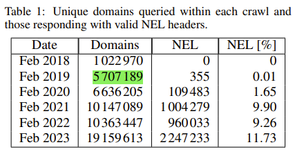
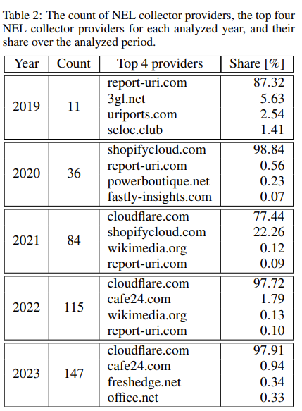
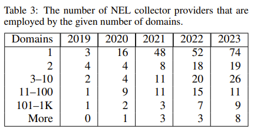
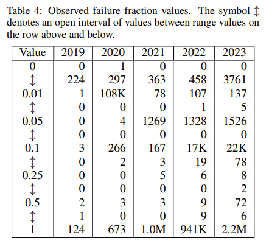

# NEL analysis data contract

Note to Libor Polčák: Toto je spísané v angličtine, aby to bolo pre Vás použiteľné vo Vašom článku, ktorý bude z práce vychádzať.

This document describes what data is expected by the `Analyze` part of the analysis lifecycle.
Its purpose is to make it easier to write implementation for all metric-computing functions by specifically
describing what the analysis data should look like (schema) and how it should be worked with (semantics).

## The Analysis

See README.md in the repository root for this project.
But to put it quick and simple, 
the goal is to find out interesting facts about deployment of the **Network Error Logging** technology (NEL).

#### NEL deployment approximate starting date

The first NEL specification was publicly released by W3C on 11th February 2014 (First Public Working Draft).
The developers continued to work on the specification until 24th May 2016 when they decided to retire their work.
The first working draft after this retirement was released on 25th September 2018.
Based on this version of NEL, **the first relevant NEL deployment sample data** can be searched for 
in HTTP Archive tables with crawl date of **1st October 2018**.

### Schema Definitions

#### Description

This section describes structure of the data required for the `Analyze` stage - analysis data.
Analysis data is obtained from the HTTP Archive project and modified by upstream stages (currently only the `Query & Store`
stage for this project).

Representing the minimal sample for a NEL deployment state analysis, analysis data contains only the crawled request &
response pairs (with additional metadata) in which the response **contained both `NEL` and `Report-To`** HTTP response
headers.
That is, analysis data **only contains correctly functional NEL** deployment instances.
To be more specific, NEL deployment is correctly functional only when HTTP response from the target web server contains 
a valid `NEL` and a valid `Report-To` headers with matching `NEL.report-to` and `Report-To.group` HTTP header values.

#### Schema

Abbreviation Legend:

| Abbrev. | Full name             |
|:--------|:----------------------|
| nel     | Network Error Logging |
| rt      | Report To             |

| Key                              |  Type   | Default To | Description                                                                                                                                                                                                                                                                                                                                                     |
|:---------------------------------|:-------:|:----------:|:----------------------------------------------------------------------------------------------------------------------------------------------------------------------------------------------------------------------------------------------------------------------------------------------------------------------------------------------------------------|
| requestId                        | INTEGER |     -      | Primary key - The particular HTTP Archive crawl request's ID                                                                                                                                                                                                                                                                                                    |
| firstReq                         |  BOOL   |     -      | This column's meaning is vague. Currently, it is not used. It was, however, used in the previous NEL analysis. That is the reason it is kept here.                                                                                                                                                                                                              |
| type                             | STRING  |     -      | Requested resource type (html, script, video, font)                                                                                                                                                                                                                                                                                                             |
| ext                              | STRING  |     -      | Requested resource file extension without the leading dot (html, json, mp4, woff2)                                                                                                                                                                                                                                                                              |
| url                              | STRING  |     -      | HTTP Archive crawl's requested URL (https://www.google.com/, https://bucket-name.s3.amazonaws.com)                                                                                                                                                                                                                                                              |
| url_etld                         | STRING  |     -      | HTTP Archive crawl's requested URL's effective Top Level Domain (com, s3.amazonaws.com) - This field is possibly OPTIONAL, currently only used because of the availability of Public Suffix List inside of the BigQuery SQL as a function taking url and returning eTLD.                                                                                        |
| status                           | INTEGER |     -      | HTTP Archive crawl's response HTTP status                                                                                                                                                                                                                                                                                                                       |
| total_crawled_resources          | INTEGER |     -      | Total count of HTTP Archive crawl's request & response pairs for resources (counts domain, subdomain and specific page crawls for every crawled domain). This field must be contained within the HTTP Archive query result, because it cannot be computed offline from only the NEL-containing resources (cannot be computed offline)                           |
| total_crawled_domains            | INTEGER |     -      | Total count of HTTP Archive crawl's request & response pairs for base domain names (counts only unique domains). Likewise, as for `total_crawled_resources`, this field cannot be computed from only the NEL-containing domains (cannot be computed offline)                                                                                                    |
| nel_max_age                      | STRING  |     -      | NEL field: `max_age`                                                                                                                                                                                                                                                                                                                                            |
| nel_failure_fraction             | STRING  |   '1.0'    | NEL field: `failure_fraction`                                                                                                                                                                                                                                                                                                                                   |
| nel_success_fraction             | STRING  |   '0.0'    | NEL field: `success_fraction`                                                                                                                                                                                                                                                                                                                                   |
| nel_include_subdomains           | STRING  |  'false'   | NEL field: `include_subdomains`                                                                                                                                                                                                                                                                                                                                 |
| nel_report_to                    | STRING  | 'default'  | NEL field: `report_to`                                                                                                                                                                                                                                                                                                                                          |
| total_crawled_resources_with_nel | INTEGER |     -      | Total count of unique resource requests to which the response returned with NEL header (counts every unique resource responses with NEL occurrence in monthly data, but the returned data itself contains only those unique resource responses that also contained Report-To headers with NEL.report-to header value matching the Report-To.group header value) |
| total_crawled_domains_with_nel   | INTEGER |     -      | Total count of unique domains that answered resource requests with responses containing NEL header (counts every unique domain responses with NEL occurrence in monthly data)                                                                                                                                                                                   |
| rt_group                         | STRING  | 'default'  | Report-To field: `group`                                                                                                                                                                                                                                                                                                                                        |
| rt_collectors                    | STRING  |     -      | Report-To, all field values: `endpoints.url[]`                                                                                                                                                                                                                                                                                                                  |

#### Analysis files

Every file MUST represent a specific month in a year for which the NEL data to be analyzed was obtained.
The convention used in the `Query & Store` phase -- `query_and_store.py` -- is naming these files as follows:
`nel_data_YYYY_MM`. 
All data files must be stored in the same directory.

### Semantics

1. When using the rows to calculate metrics for NEL deployment - every row in the data represents a request-response pair. 
   The requested (crawled) endpoint (`url` column) is not always the domain itself.
   A row can be a request to a unique DOMAIN, SUB-DOMAIN of that DOMAIN or a SUB-PAGE of that domain
   (an example could be a row with `url = https://domain/sub/page/path?query=string`).
   Each row in the nel data therefore **DOES NOT represent a unique domain**.

2. When counting valid NEL deployments - every requests-response pair in the data must be using protocol HTTPS. 
   NEL only works over HTTPS, not HTTP.

[//]: # (TODO Is there anything else to point out and handle ?)

### Custom - Metrics

#### Questions to be answered - TODO(Libor Polčák)

1. Should the metrics be computed on MONTHLY basis or YEARLY basis ? (resulting data only a table of year=2018->2024 OR a table of 2018/01, /02, /03 -> 2024/01) 

   Answer: (it depends on a specific metric, but I need your opinion on what suits each the best)

1. Where to use the eTLD and PSL (Public Suffix List) ? Convert `url` and `rt_collectors` data columns to eTLD+1 before working with them in `Analyze` stage ? 

   Answer:

2. The Public Suffix List is literally managed on GitHub via commits of eTLD additions. Can we use only one global PSL to parse `url` and `rt_collectors` into eTLD+1 ?

   Answer:

3. Is the `Query & Store` data good to go ? Can we start downloading all the data ? (This will consume all the BigQuery querying resources... and maybe even overcharge)

   Answer: 

4. Which metrics to implement ?

   Answer:

#### Previous analysis (LPolcak, KJerabek) metrics (base)

1. Unique domains queried within each year and those responding with valid NEL headers

   - RESULTS: Year; Total Domains Count; NEL Count; NEL Percentage (% out of all domains that returned response containing
     NEL)
   - Should we use eTLD+1 instead of base domains (column Domains, but also applies to NEL Domains)

      

2. The count of NEL collector providers (OUT_1), the top four NEL collector providers for each analyzed year (OUT_2), and their share
   over the analyzed period (OUT_3)
    
   - Should we use eTLD+1 as provider domains instead of the used collector Second Level Domain ?
      
   

3. The number of NEL collector providers that are employed by a given number of domains (Number of collectors employed
   by 1, 2, 3-10, 11-100, 101-1K and more domains).
   
   - Again. Count by eTLD+1 ?   

      

4. NEL configuration over time 
   - Divide the 4 NEL configuration fields (max_age, succ_rate, fail_rate, incl_subd) 
   into classes of used value intervals and compute yearly distribution into those classes

   - Example:
       

#### New analysis metrics (xjurik12 proposals)

1. The beginning of NEL
   - Who used NEL the first and when

2. The type of resource NEL is used for the most
    1. Take a month from the nel data
    2. Extract all TYPE values and sort them by count of their occurrence (as a NEL monitored resource type)
    3. Calculate the ratio of the total use for each TYPE
    4. Extract EXT values for the top N (top 10) used TYPEs (group by type) and find the most used EXT for every TYPE
    5. Calculate the ratio of the total use of the most used EXT for a specific TYPE

3. Famous / Popular companies using NEL
    - Use a list of popular domains to filter domains like these out
    - Or observe manually

4. Usage of NEL over time
    - In the aggregated set of NEL usage metric data, look for trends to describe (company started using, stopped, then
      after 2 years started again)

5. Trends emerging over the years
    - Preferred configuration field values during certain times
    - Configuration almost never used
    - Companies STARTING to use NEL in big numbers
    - Companies STOPPING to use NEL in big numbers

6. Domains eligible for real-time analysis
    1. Pick out some domains having a large number of subdomains and sub-pages crawled on HTTP Archive
    2. Run Selenium scripts on those and compare output

[//]: # (TODO Selenium script metrics)