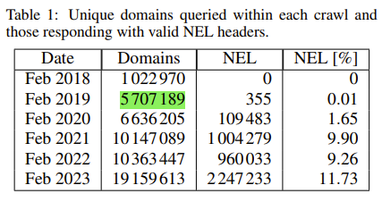
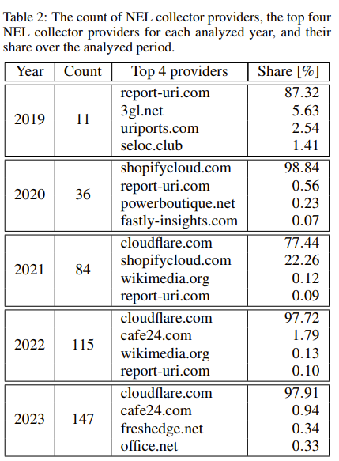
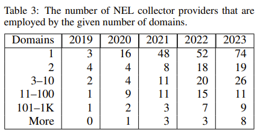
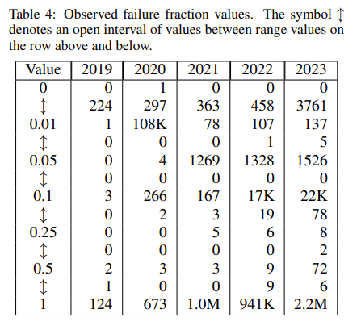

# NEL analysis data contract

This document describes what data is expected by the `Analyze` part of the analysis lifecycle.
Its purpose is to make it easier to write implementation for all metric-computing functions by specifically
describing what the analysis data should look like (schema) and how it should be worked with (semantics).

## The Analysis

See README.md in the repository root for this project.
But to put it quick and simple, 
the goal is to find out interesting facts about deployment of the **Network Error Logging** technology (NEL).

#### NEL deployment approximate starting date

The first NEL specification was publicly released by W3C on 11th February 2014 (First Public Working Draft).
The developers continued to work on the specification until 24th May 2016 when they decided to retire their work.
The first working draft after this retirement was released on 25th September 2018.
Based on this version of NEL, **the first relevant NEL deployment sample data** can be searched for 
in HTTP Archive tables with crawl date of **1st October 2018**.

### Schema Definitions

#### Description

This section describes structure of the data required for the `Analyze` stage - analysis data.
Analysis data is obtained from the HTTP Archive project and modified by upstream stages (currently only the `Query & Store`
stage for this project).

Representing the minimal sample for a NEL deployment state analysis, analysis data contains only the crawled request &
response pairs (with additional metadata) in which the response **contained both `NEL` and `Report-To`** HTTP response
headers.
That is, analysis data **only contains correctly functional NEL** deployment instances.
To be more specific, NEL deployment is correctly functional only when HTTP response from the target web server contains 
a valid `NEL` and a valid `Report-To` headers with matching `NEL.report-to` and `Report-To.group` HTTP header values.

#### Schema

Abbreviation Legend:

| Abbrev. | Full name             |
|:--------|:----------------------|
| nel     | Network Error Logging |
| rt      | Report To             |

[//]: # (TODO make sure the schema is FINAL - see the agreed upon metrics to determine if any more computation needs to be done ONLINE)

| Key                                      |     Type      | Default To | Description                                                                                                                                                                                                                                                                                                                                                                                                                                                                                                                                                                        |
|:-----------------------------------------|:-------------:|:----------:|:-----------------------------------------------------------------------------------------------------------------------------------------------------------------------------------------------------------------------------------------------------------------------------------------------------------------------------------------------------------------------------------------------------------------------------------------------------------------------------------------------------------------------------------------------------------------------------------|
| requestId                                |    INTEGER    |     -      | Primary key - The particular HTTP Archive crawl request's ID.                                                                                                                                                                                                                                                                                                                                                                                                                                                                                                                      |
| firstReq                                 |     BOOL      |     -      | There seems to be no formal description of this field. From HTTP Archive blog and this project's experience: A flag determining whether the resource identified with this row's `url` field was the first requested resource for a given domain. However, resources with `firstReq = true` do not count up to the number of `total_crawled_domains`. This possibly means that `firstReq` does not distinguish between a domain and it's sub-domains (if a domain is entered with `firstReq = true`, any of that domain's sub-domain crawled will allways have `firstReq = false`). |
| type                                     |    STRING     |     -      | Requested resource type (html, script, video, font).                                                                                                                                                                                                                                                                                                                                                                                                                                                                                                                               |
| ext                                      |    STRING     |     -      | Requested resource file extension without the leading dot (html, json, mp4, woff2).                                                                                                                                                                                                                                                                                                                                                                                                                                                                                                |
| status                                   |    INTEGER    |     -      | HTTP Archive crawl's response HTTP status.                                                                                                                                                                                                                                                                                                                                                                                                                                                                                                                                         |
| url                                      |    STRING     |     -      | HTTP Archive crawl's requested URL (https://www.google.com/, https://bucket-name.s3.amazonaws.com).                                                                                                                                                                                                                                                                                                                                                                                                                                                                                |
| url_domain                               |    STRING     |     -      | The domain name parsed from HTTP Archive crawl's requested URL.                                                                                                                                                                                                                                                                                                                                                                                                                                                                                                                    |
| url_domain_registrable                   |    STRING     |     -      | The registered domain name parsed from HTTP Archive crawl's requested URL (parsed using an UP-TO-DATE Public Suffix List provided by Big Query functions).                                                                                                                                                                                                                                                                                                                                                                                                                         |
| url_domain_hosted_resources              |    INTEGER    |     -      | The number of resources on that specific `url_domain` (NOT `url_domain_registrable`!!!).                                                                                                                                                                                                                                                                                                                                                                                                                                                                                           |
| url_domain_hosted_resources_with_nel     |    INTEGER    |     -      | The number of resources that were NEL-monitored on that specific `url_domain` (can be used to mark domains worth crawling using Selenium - real time crawling script to obtain analysis data like this).                                                                                                                                                                                                                                                                                                                                                                           |
| url_domain_monitored_resources_ratio     |     FLOAT     |     -      | Ratio of NEL-monitored resources to non-NEL-monitored resources hosted on that specific `url_domain`. This value is _PRE-COMPUTED_ to save time during the analysis itself.                                                                                                                                                                                                                                                                                                                                                                                                        |
| total_crawled_resources                  |    INTEGER    |     -      | Total count of HTTP Archive crawl's request & response pairs for resources (counts domain, subdomain and specific page crawls for every crawled domain). This field must be contained within the HTTP Archive query result, because it cannot be computed offline from only the NEL-containing resources (cannot be computed offline).                                                                                                                                                                                                                                             |
| total_crawled_domains                    |    INTEGER    |     -      | Total count of HTTP Archive crawl's request & response pairs for base domain names (counts only unique domains). Likewise, as for `total_crawled_resources`, this field cannot be computed from only the NEL-containing domains (cannot be computed offline).                                                                                                                                                                                                                                                                                                                      |
| total_crawled_resources_with_nel         |    INTEGER    |     -      | Total count of unique resource requests to which the response returned with **_ANY_** NEL header (counts every unique resource responses with NEL occurrence in monthly data, but the returned data itself contains only those unique resource responses that also contained Report-To headers with `NEL.report-to` header value matching the `Report-To.group` header value). _Cannot be computed OFFLINE_.                                                                                                                                                                       |
| total_crawled_domains_with_nel           |    INTEGER    |     -      | Total count of unique domains that answered resource requests with responses containing **_ANY_** NEL header (counts every unique domain responses with NEL occurrence in monthly data). _Cannot be computed OFFLINE_.                                                                                                                                                                                                                                                                                                                                                             |
| total_crawled_resources_with_correct_nel |    INTEGER    |     -      | Total count of unique resource requests to which the response returned with **_CORRECT_** NEL header (counts every resource -- `url` -- in returned data table). _PRE-COMPUTED_ field.                                                                                                                                                                                                                                                                                                                                                                                             |
| total_crawled_domains_with_correct_nel   |    INTEGER    |     -      | Total count of unique domains that answered resource requests with responses containing **_CORRECT_** NEL header (counts every domain -- `url_domain` -- in the returned data table). _PRE-COMPUTED_ field to save time during the analysis itself.                                                                                                                                                                                                                                                                                                                                |
| nel_max_age                              |    STRING     |     -      | NEL field: `max_age`.                                                                                                                                                                                                                                                                                                                                                                                                                                                                                                                                                              |
| nel_failure_fraction                     |    STRING     |   '1.0'    | NEL field: `failure_fraction`.                                                                                                                                                                                                                                                                                                                                                                                                                                                                                                                                                     |
| nel_success_fraction                     |    STRING     |   '0.0'    | NEL field: `success_fraction`.                                                                                                                                                                                                                                                                                                                                                                                                                                                                                                                                                     |
| nel_include_subdomains                   |    STRING     |  'false'   | NEL field: `include_subdomains`.                                                                                                                                                                                                                                                                                                                                                                                                                                                                                                                                                   |
| nel_report_to                            |    STRING     | 'default'  | NEL field: `report_to`. The `Report-To.group` field must match this field's value (that is also why `Report-To.group` is not kept in this schema).                                                                                                                                                                                                                                                                                                                                                                                                                                 |
| rt_collectors                            | ARRAY<STRING> |     -      | Report-To, all domain names parsed from field values: `endpoints.url[]`.                                                                                                                                                                                                                                                                                                                                                                                                                                                                                                           |
| rt_collectors_registrable                | ARRAY<STRING> |     -      | Report-To, all registrable domain names parsed from field values: `endpoints.url[]` (parsed using an UP-TO-DATE Public Suffix List provided by Big Query functions).                                                                                                                                                                                                                                                                                                                                                                                                               |

#### Analysis files

Every file MUST represent a specific month in a year for which the NEL data to be analyzed was obtained.
The convention used in the `Query & Store` phase -- `query_and_store.py` -- is naming these files as follows:
`nel_data_YYYY_MM`. 
All data files must be stored in the same directory.

### Semantics

1. Each data row represents a unique domain name (see the `url_domain` column). There are usually many more 
   resources available for each domain in the HTTP Archive data, but because distributed computing algorithm is necessary 
   to compute so much data **_in a timely manner_**, the data for the `Analysis` phase is 
   sampled -- `n=1` -- where `n` represents the number of resources to download per a unique domain.
   To state the problem encountered, reading a 01/02/2021 (not even halfway through the analysis) 
   month data takes around 251 secs (`pandas.read_parquet(month_data)`). The metric computing functions by themselves 
   each take even more time to finish computing 
   (with the same **_MONTH_** data: `yearly_nel_deployment` took 328 secs; `nel_collector_providers` took 758 secs). 

2. However, no change is to be made to the `Query & Store` script. The raw downloaded data is still resource-normalized.
   To comply with the point above, a `Postprocess` phase is to be introduced to create a new, stripped dataset, that
   is to be url_domain-normalized (`n=1` for `n` representing resource count per unique domain).
   This means that the original, full size data is kept, but the `Analysis` will use the resource stripped/sampled data
   to make this project finish-able in due time.
   
   [//]: # (TODO update 1. & 2. one more time after having the analysis done)

3. When counting valid NEL deployments - every requests-response pair in the data must be using protocol HTTPS. 
   NEL only works over HTTPS, not HTTP. 
   IMPORTANT NOTE: This is not accounted for in the analysis. For now, even HTTP responses with NEL are counted.

[//]: # (TODO Is there anything else to point out and handle ?)

### Metrics

#### Previous analysis (LPolcak, KJerabek) metrics (base)

1. Unique domains queried within each month and those responding with valid NEL headers

      

2. The count of NEL collector providers, the top four NEL collector providers for each analyzed month, and their share
   over the analyzed period

      **_IMPORTANT NOTE:_** As in the Kamil Jerabek's script (python notebook for collector provider metric),
      I only use the primary collector provider = `rt_collectors[0]` to count, parse eTLD+1 and sort providers.

      

3. The number of NEL collector providers that are employed by a given number of domains (Number of collectors employed
   by 1, 2, 3-10, 11-100, 101-1K and more domains)

      

4. NEL configuration over time 
   - Divide the 4 NEL configuration fields (max_age, succ_rate, fail_rate, incl_subd) 
   into classes of used value intervals and compute monthly distribution into those classes

      - Example:
        

#### New analysis metrics (xjurik12 proposals, ordered as they could be presented)

    1. The first available Collector providers
       - Mention worthy. Just textual output

	2. The 3 base metrics
       - [OK] See points 1., 2. & 3. of the previous section
       - Maybe add a graph displaying the increase in NEL deployment over the whole period (the mentioned point 1.)

	4. The most used collector providers over the whole period (2018-2024) - deployment begin and remove points in time
       - Lifetime of the collector providers. Who was just experimenting & who really means business?
       - 1.: Each provider has a mark in the graph, 
         - x-axis = number of months/occurrences of the provider availability
         - y-axis = max reporting domains
       - 2.: 
         - x-axis = time (month)
         - y-axis = bins of number of reporting domains
         - plot point (heat) content: count of collectors handling the reports

    5. Additional interesting collector metrics:
        a. len(rt_collectors) as a metric      
        b. top N primary collectors     
        c. top N secondary collectors
        d. top N tertiary collectors (probably stop at secondary collectors)     
        e. top N TOTAL (all occurrences, any priority) collectors

    6. Ratio of NEL-monitored resources to non-NEL-monitored resources
       - url_domain_hosted_resources_with_nel / url_domain_hosted_resources * 100 (for each domain)
       - Variability/variety of the NEL configuration on the domain
       - Visualize probably via a heat graph

    7. Configuration metrics
          a. [OK] By separate NEL fields (See point 4. of the previous section)
    
    8. Overview of the monitored resource types (html, js, img, video)

	9. Popular domain metrics (case study for the popular sites from TRANCO - interesting domains analysis)
       
       This section still uses HTTP Archive as the analysis data source 
          a. NEL Usage (as in point 1. of the previous section)
          b. Employed Collectors (as in point 2. & 3. of the previous section)
          c. Most used config (as in point 4. of the previous section)
          d. Deployment changes in time (start, stop - as in point 4. of THIS section)

       Then... This point can be complemented with the Selenium real-time crawling script: 
          a. Compare results of point 8. (this section) 
          b. Compare results of point 9. (this point) for the latest available month (probably 2024-02)
             with the results of a real-time Selenium crawl

	10. Eligible domains to crawl for NEL in Real-Time
       a. Domains having interesting ratio of NEL-monitored resources to non-NEL-monitored resources (high url_domain_hosted_resources_with_nel)
       b. Domains from the TRANCO list

       Crawl these domains in real-time to add more interesting findings to the point 9. of this section 
         - Is the deployed NEL on these domains consistent ? 
         - Is the NEL-monitored to non-monitored ratio still the same ?
         - What are the prevalent types of monitored resources ?
      
       In either way... the Selenium crawl scirpt will be separate of the Selenium analyis script, so new metrics
       can be added at a later time. The important thing is crawling for the data.
